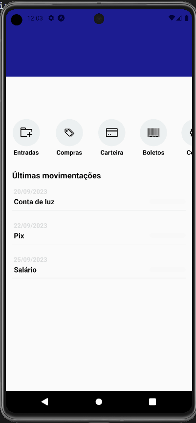

# Finanças App

Este README descreve a estrutura e funcionalidade de um aplicativo financeiro simples em React Native construído com TypeScript. O aplicativo inclui uma tela inicial que exibe o saldo do usuário, transações recentes e botões de ação rápida.

## Visão Geral



O aplicativo é estruturado em vários componentes, cada um responsável por renderizar uma parte da interface do usuário:

- `App`: O componente raiz que renderiza a tela `Home`.
- `Home`: A tela principal do aplicativo que agrega outros componentes.
- `Header`: Exibe o nome do usuário e um ícone de usuário.
- `Balance`: Mostra o saldo atual e as despesas do usuário.
- `Movements`: Lista as transações financeiras recentes do usuário.
- `Actions`: Fornece botões de ação rápida para tarefas comuns.

## Instalação

Para executar este projeto, você precisará ter o Node.js instalado em sua máquina. Também precisará do npm ou Yarn para gerenciar os pacotes.

1. Clone o repositório para sua máquina local.
2. Navegue até o diretório do projeto.
3. Execute `npm install` ou `yarn install` para instalar as dependências.
4. Inicie o aplicativo com `npm start` ou `yarn start`.

## Componentes

### `App`

O ponto de entrada da aplicação. Simplesmente renderiza o componente `Home`.

```tsx
import Home from './src/screens/Home';

export default function App() {
  return <Home />;
}
```

### `Home`

O componente da tela inicial que reúne o `Header`, `Balance`, `Actions` e uma lista de `Movements` recentes.

```tsx
import { View, Text, FlatList, StyleSheet } from 'react-native';
import Header from '../../components/Header';
import Balance from '../../components/Balance';
import Movements from '../../components/Movements';
import Actions from '../../components/Actions';

// ... Implementação do componente Home
```

### `Header`

Exibe o nome do usuário e um botão com um ícone de usuário.

```tsx
import { View, Text, TouchableOpacity, StyleSheet, StatusBar } from 'react-native';
import { Feather } from '@expo/vector-icons';
import { MotiView, MotiText } from 'moti';

// ... Implementação do componente Header
```

### `Balance`

Mostra o saldo e as despesas do usuário com uma animação de virada ao carregar.

```tsx
import { View, Text, StyleSheet } from 'react-native';
import { MotiView } from 'moti';

// ... Implementação do componente Balance
```

### `Movements`

Renderiza uma lista de transações financeiras, permitindo que o usuário toque em um item para mostrar ou ocultar o valor da transação.

```tsx
import { TouchableOpacity, Text, View, StyleSheet } from 'react-native';
import { MotiView, AnimatePresence, MotiText } from 'moti';

// ... Implementação do componente Movements
```

### `Actions`

Fornece uma visualização de rolagem horizontal com botões para diferentes ações financeiras, como adicionar transações, marcar compras, etc.

```tsx
import { ScrollView, TouchableOpacity, Text, View, StyleSheet } from 'react-native';
import { AntDesign } from '@expo/vector-icons';

// ... Implementação do componente Actions
```

## Estilos

Cada componente tem sua própria `StyleSheet` definida na parte inferior de seu arquivo, que é usada para estilizar os elementos do componente.

## Dependências

- `react-native`: O framework usado para construir o aplicativo.
- `react-native-reanimated`: Uma biblioteca para suportar animações mais complexas.
- `moti`: Uma biblioteca para simplificar animações no React Native.
- `@expo/vector-icons`: Uma biblioteca que fornece muitos ícones para usar no aplicativo.

## Executando o Aplicativo

Para executar o aplicativo em seu dispositivo, você precisará ter o Expo CLI instalado e um simulador iOS ou Android configurado em sua máquina. Alternativamente, você pode usar o aplicativo Expo Go para executá-lo em um dispositivo físico.

## Conclusão

Este aplicativo React Native é um exemplo simples, mas funcional, de uma ferramenta de gerenciamento financeiro. Ele demonstra o uso de animações, gerenciamento de estado e arquitetura baseada em componentes em uma aplicação móvel.
